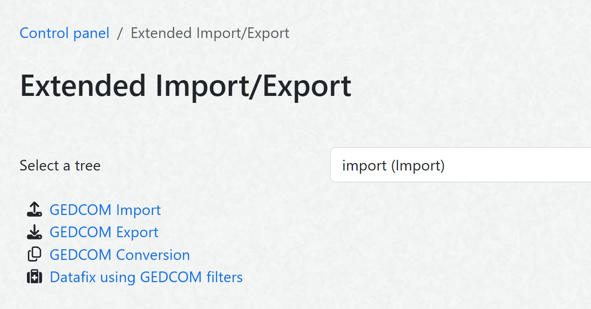

# Extended Import/Export
### (Earlier name: Extended Import/Export Overview)
A [webtrees](https://webtrees.net) 2.1 custom module for **advanced GEDCOM import, export and filter operations**. The module also supports **remote downloads/uploads via URL requests**.

The module provides a framework for **customizable GEDCOM filters**, which allow to modify the GEDCOM data during an import/export. A set of pre-configured GECCOM filters is provided and supports GEDCOM 7 conversion and a variety of other GEDCOM filtering operations. The GEDCOM filters can be triggered remotely as well as by the user in the control panel or with a data fix.

##  Table of contents
This README file contains the following main sections:
+   [Overview](#extended-importexport-overview)
+   [What are the benefits of using this module?](#what-are-the-benefits-of-this-module)
+   [Screenshot](#screenshot)
+   [Installation](#installation)
+   [Webtrees Version](#webtrees-version)
+   [Remote API](#remote-api)
    + [URL Format for Remote Requests](#url-format-for-remote-requests)
    + [Example URLs for Remote Requests](#example-urls-for-remote-requests)
    + [Values for URL Parameters](#values-for-url-parameters)
+   [Folder for Files to Import/Export/Convert](#folder-for-files-to-importexportconvert)
+   [Authorization Key Settings](#authorization-key-settings)
+   [Default Values in the Module Settings (Control Panel)](#default-values-in-the-module-settings-control-panel))
+   [Recommended Steps to Test the Module](#recommended-steps-to-test-the-module)
+   [GEDCOM 7 Conversion](#gedcom-7-conversion)
+   [Translation](#translation)
+   [Bugs and Feature Requests](#bugs-and-feature-requests)
+   [Github Repository](#github-repository)

## What are the benefits of this module?
+ Applying GEDCOM filters during import/export
    + Download/upload/convert GEDCOM files in the GEDCOM 7 format
    + Improve the GEDCOM export before downloading, e.g. avoid leading spaces in CONT structures, remove non-standard RESN, remove CHAN data, ...
    + Remove empty and unlinked records, which result from privacy settings in webtrees
    + Create your own customizable GEDCOM filter
    + Run a sequence of GEDCOM filters or combine several filters
    + Convert GEDCOM files with GEDCOM filters
+ Remote download/upload/save
    + Remotely download/upload GEDCOM files without logging into the user interface (webtrees front end)
    + Download/Upload GEDCOM files with a script, see attached [example scripts](#example-scripts)
    + Remotely trigger to save GEDCOM files to a folder on the webtrees server without logging into the user interface (webtrees front end)
    + Schedule regular GEDCOM file backups on the server with a Cron Job, see attached [example script](#example-scripts)
    + Apply GEDCOM filters during remote download/upload

## IMPORTANT SECURITY NOTES
**Module versions starting from v3.0.0 use an authorization key**, which is stored in the module preferences in webtrees. Access to the download is only allowed if the provided key in the URL is identical to a authorization key in the webtrees database (settings).

**Please note that everyone with access to the authorization key, can download/upload GEDCOM files from/to your webtrees installation.**

**It is highly recommended to use the HTTPS protocol** (i.e. URLs with https://...) in order to encrypt the URL parameters, especially the authorization key.

Please note that the earlier **versions v1.0.0 and v2.0.0 did NOT use an authorization key**. This means that installing these module versions enables everyone, who can reach the webtrees URL, to download GEDCOM files from webtrees. **Therefore, it is highly recommended to uprade to a module version v3.0.0 or later**.

##  Screenshot

## Installation
+ Download the [latest release](https://github.com/Jefferson49/DownloadGedcomWithURL/releases/latest) of the module
+ Copy the folder "download_gedcom_with_url" into the "module_v4" folder of your webtrees installation
+ Check if the module is activated in the control panel:
  + Login to webtrees as an administrator
	+ Go to "Control Panel/All Modules", and find the module called "DownloadGedcomWithURL"
	+ Check if it has a tick for "Enabled"
+ If remote download/upload/saving of GEDCOM files shall be used, activate the related options in the control panel, see chapter below.
+ If remote options are activated, provide an authorization key in the module settings, see chapter below.
+ Optionally, specify default settings in the control panel, which might reduce the number of parameters to be provided within the URL.

## Webtrees Version
The module was developed and tested with [webtrees 2.1.20](https://webtrees.net/download), but should also run with any other 2.1 version.

## Remote API

### URL Format for Remote Requests
The full URL format, which contains all possible parameters is defined as follows:

**BASE_URL**/index.php?route=/webtrees/**DownloadGedcomWithURL**  
&emsp;**&action**=[MY_ACTION](#MY_ACTION)  
&emsp;**&tree**=[MY_TREE](#MY_TREE)  
&emsp;**&key**=[MY_KEY](#MY_KEY)  
&emsp;**&file**=[MY_FILENAME](#MY_FILENAME)  
&emsp;**&format**=[MY_EXPORT_FORMAT](#MY_EXPORT_FORMAT)  
&emsp;**&privacy**=[MY_PRIVACY_LEVEL](#MY_PRIVACY_LEVEL)  
&emsp;**&encoding**=[MY_ENCODING](#MY_ENCODING)  
&emsp;**&line_endings**=[MY_ENDINGS](#MY_ENDINGS)  
&emsp;**&time_stamp**=[MY_TIME_STAMP](#MY_TIME_STAMP)  
&emsp;**&gedcom_filter1**=[MY_GEDCOM_FILTER1](#MY_GEDCOM_FILTER)  
&emsp;**&gedcom_filter2**=[MY_GEDCOM_FILTER2](#MY_GEDCOM_FILTER)  
&emsp;**&gedcom_filter3**=[MY_GEDCOM_FILTER3](#MY_GEDCOM_FILTER)  
&emsp;**&import_encoding**=[MY_IMPORT_ENCODING](#MY_IMPORT_ENCODING)  
&emsp;**&keep_media**=[MY_KEEP_MEDIA](#MY_KEEP_MEDIA)  
&emsp;**&word_wrapped_notes**=[MY_WORD_WRAPPED_NOTES](#MY_WORD_WRAPPED_NOTES)  
&emsp;**&gedcom_media_path**=[MY_GEDCOM_MEDIA_PATH](#MY_GEDCOM_MEDIA_PATH)

**BASE_URL** is the webtrees base URL, which is defined in the config.ini.php file, e.g. base_url="https://dev.webtrees.net/demo-stable".

The "MY_XXX" place holders need to be replaced by the specific parameter values, which shall be used for the upload/download/conversion. The possible values for the URL parameters are described below. 

Most of the parameters match 1:1 to the webtrees import/xport settings in the control panel. To gain a better understanding of these parameters, it is very helpful to check these parameters and run some manual tests in the control panel.

It is not mandatory to provide all parameters. The only mandatory parameters are the tree and the authorization key. If any of the other parameters is not provided as URL parameter, the default value, which is specified in the control panel, is used. The tree name is used as default value for the file name. Download is used as default action.

### Example URLs for Remote Requests
BASE_URL/index.php?route=/webtrees/DownloadGedcomWithURL&tree=tree1&key=hYHBiZM9

BASE_URL/index.php?route=/webtrees/DownloadGedcomWithURL&tree=tree1&key=hYHBiZM9file=export

BASE_URL/index.php?route=/webtrees/DownloadGedcomWithURL&action=both&tree=tree1&key=hYHBiZM9&file=export&privacy=user&format=zip&encoding=ANSEL&line_endings=LF&time_stamp=prefix&gedcom_filter1=GEDCOM_7_ExportFilter

### Values for URL Parameters  
* **<a name="MY_ACTION">MY_ACTION</a>** specifies whether the GEDCOM file will be uploaded, converted, downloaded, saved on the server, or both (downloaded and saved)
  * Accepted values: **download** (default), save, both, upload, convert
  * The folder within the webtrees root path to save GEDCOM files can be specified in the module settings in the control panel

* **<a name="MY_TREE">MY_TREE</a>** specifies the webtrees tree name
  * This is a mandatory parameter. If it is not provided in the URL, the remote request will be denied.

* **<a name="MY_KEY">MY_KEY</a>** specifies a authorization key, which restricts the access to the download
  * This is a mandatory parameter. If it is not provided in the URL, the remote request will be denied.

* **<a name="MY_FILENAME">MY_FILENAME</a>** has to be provided without .ged extension, i.e. use this_file instead of this_file.ged
  * The tree name (MY_TREE) is taken as default if MY_FILENAME is not provided

* **<a name="MY_EXPORT_FORMAT">MY_EXPORT_FORMAT</a>** specifies the file format for the export
  * Accepted values: **gedcom** (default), zip, zipmedia, gedzip

* **<a name="MY_PRIVACY_LEVEL">MY_PRIVACY_LEVEL</a>** specifies the user role, in which the GEDCOM export is executed
  * Accepted values: **none** (default), gedadmin, user, visitor

* **<a name="MY_ENCODING">MY_ENCODING</a>** specifies the encoding of the generated GEDCOM file
  * Accepted values: **UTF-8** (default), UTF-16BE, ANSEL, ASCII, CP1252

* **<a name="MY_ENDINGS">MY_ENDINGS</a>** specifies the line endings in the generated GEDCOM file
  * Accepted values: **CRLF** (default), LF

* **<a name="MY_TIME_STAMP">MY_TIME_STAMP</a>** specifies whether a (GMT) time stamp will be added to the file name of saved GEDCOM files. MY_TIME_STAMP also defines whether the time stamp is added as prefix or as a postfix.
  * Accepted values: **none** (default), prefix, postfix

* **<a name="MY_GEDCOM_FILTER">MY_GEDCOM_FILTER1/2/3</a>** specifies a GEDCOM filter to be executed during the import/export/conversion.
  * Accepted values: Filter names (without .php extension) of existing GEDCOM filter in the following webtress directory: **modules_v4/download_gedcom_with_url/ressources/filter/**. For example, "GEDCOM_7_GedcomFilter" is chosen for a GEDCOM 7 conversion.

* **<a name="MY_IMPORT_ENCODING">MY_IMPORT_ENCODING</a>** overrides the encoding specified in the header of the GEDCOM import file
  * Accepted values: ASCII, ANSEL, UTF-8, UTF-16BE, ...
  * Further allowed values can be found [in the webtrees EncodingFactory](https://github.com/fisharebest/webtrees/blob/main/app/Factories/EncodingFactory.php#L98)

* **<a name="MY_KEEP_MEDIA">MY_KEEP_MEDIA</a>** specifies whether media shall be kept during import
  * Accepted values: 1 (true), 0 (false)
  * The last import setting of the tree is used as default

* **<a name="MY_WORD_WRAPPED_NOTES">MY_WORD_WRAPPED_NOTES</a>** specified whether to reinsert the missing spaces if spaces are omiited in the import file during splitting of long lines
  * Accepted values: 1 (true), 0 (false)
  * The last import setting of the tree is used as default

* **<a name="MY_GEDCOM_MEDIA_PATH">MY_GEDCOM_MEDIA_PATH</a>** specifies a part of the media file path, which shall be removed from file names during the GEDCOM import
  * Accepted values: A file path used in the GEDCOM import file, e.g. "C:\Documents\"
  * If the file path contains slashes, the value needs to be included in brackets 

### Example URLs for Download/Saving
+ BASE_URL/index.php?route=/webtrees/**DownloadGedcomWithURL**&tree=tree1&key=hYHBiZM9

+ BASE_URL/index.php?route=/webtrees/**DownloadGedcomWithURL**&tree=tree1&key=hYHBiZM9file=export

+ BASE_URL/index.php?route=/webtrees/**DownloadGedcomWithURL**&action=both&tree=tree1&key=hYHBiZM9&file=export&privacy=user&format=zip&encoding=ANSEL&line_endings=LF&time_stamp=prefix&gedcom_filter1=GEDCOM_7_GedcomFilter

### Folder for Files to Import/Export/Convert
The files to be imported or converted must be placed in a folder on the webtrees server. The folder specified in the settings for the download/upload folder in the control panel settings.

### Authorization Key Settings
The key parameter of the URL is checked against an authorization key. **The authorization key is specified and stored in the module settings**: Control Panel / Modules / All Modules / Extended Import/Export.

The provided authorization key needs to have a minimum length of 8 characters.

**The control panel also provides an option for the authorization key to be saved as an encrypted hash value**. This option is more secure, because the authorization key is not visible to anyone and also encrypted in the database. However, the authorization key is not readible any more (even for administrators) and cannot be recovered if it is forgotten.

### Default Values in the Module Settings (Control Panel)
In the control panel, it is possible to provide default values for most of the URL parameters. These default settings are used if no specific parameter values are provided within the URL. By specifying the default values, the URLs to be called for a download can be simplified. If the default values shall be used for a download, it is sufficient to only provide the tree name and the authorization key in the URL.

Any parameters provided in the URL have a higher priority and will overrule the default settings from the control panel.

### Example Scripts 
The release ZIP file of the DownloadGedcomWithURL module also contains 3 example scripts for automatic download of GEDCOM files or storage on the server:
+ [ExampleBashScript\.sh](https://github.com/Jefferson49/DownloadGedcomWithURL/blob/main/ExampleBashScript.sh) contains a simple example, how a GEDCOM file can be stored on the webtrees server. To trigger a store process in regular time intervals, this bash script could be triggered by a Cron Job.
+ [ExamplePythonScript\.py](https://github.com/Jefferson49/DownloadGedcomWithURL/blob/main/ExamplePythonScript.py) contains a simple example, how an automatic download can be performed with a Python script, e.g. on a Windows PC
+ [ExamplePythonScript2\.py](https://github.com/Jefferson49/DownloadGedcomWithURL/blob/main/ExamplePyhtonScript2.py) contains a more advanced example for an automatic download with a Python script, which allows to store the downloaded file to a specific folder and also includes some logging output

### Recommended Steps to Test the Module
In order to test systematically and have some control about the effects, the following steps are recommend. Only proceed to the next step if the prior step was successful:
+ Choose or create a small test tree
+ Run a manual export in the webtrees control panel with certain export settings
+ Run a remote test export by calling an URL (e.g. in a browser or from a text editor) with exactly the same settings like above
+ Run a remote test export with a script (e.g. based on one of the provided [example scripts](#example-scripts)) with exactly the same settings like above
+ If everything works fine, choose larger trees etc.

### GEDCOM 7 Conversion
DownloadGedcomWithURL contains a GEDCOM filter, which performs a GEDCOM 7 conversion. The GEDCOM 7 filter can be used during import/export, in a datafix, and for conversion of GEDCOM files.

The GEDCOM 7 export also includes a further option to use the German GEDCOM-L standard.

The GEDCOM 7 filter were successfully valdidated with [GEDCOM Validator](https://chronoplexsoftware.com/gedcomvalidator/) and 
[Gedcom Structure Analysis](https://ofb.hesmer.name/main_gsp_e.html#Analyse). Gedcom Structure Analysis also validates against the [GEDCOM-L standard](https://genealogy.net/GEDCOM/).

## Translation
You can help to translate this module. The translation is based on [gettext](https://en.wikipedia.org/wiki/Gettext) and uses .po files, which can be found in [/resources/lang/](https://github.com/Jefferson49/DownloadGedcomWithURL/tree/main/resources/lang). You can use a local editor like [Poedit](https://poedit.net/) or notepad++ to work on translations and provide them in the [Github repository](https://github.com/Jefferson49/DownloadGedcomWithURL) of the module. You can do this via a pull request (if you know how to do), or by opening a new issue and attaching a .po file. Updated translations will be included in the next release of this module.

Currently, the following languages are already available:
+ English
+ German

## Bugs and Feature Requests
If you experience any bugs or have a feature request for this webtrees custom module, you can [create a new issue](https://github.com/Jefferson49/DownloadGedcomWithURL/issues).

## Github Repository
https://github.com/Jefferson49/DownloadGedcomWithURL